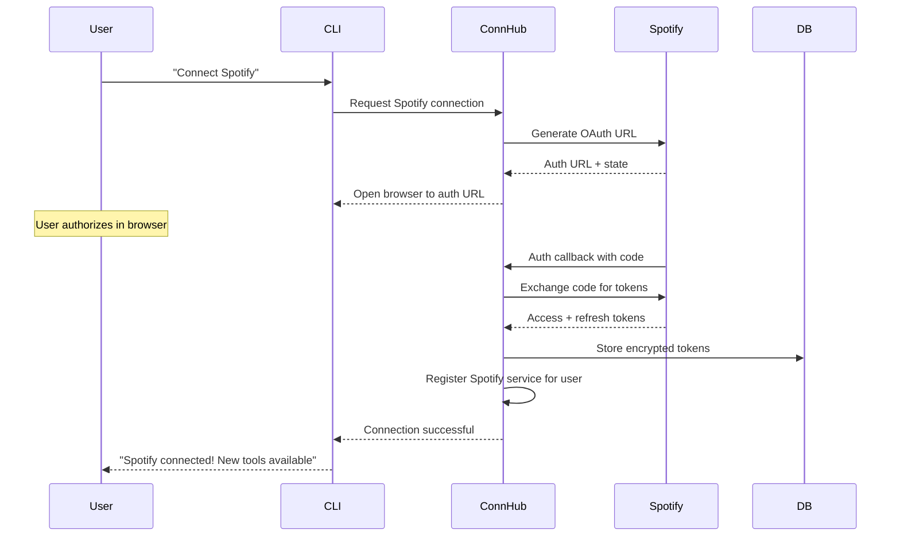
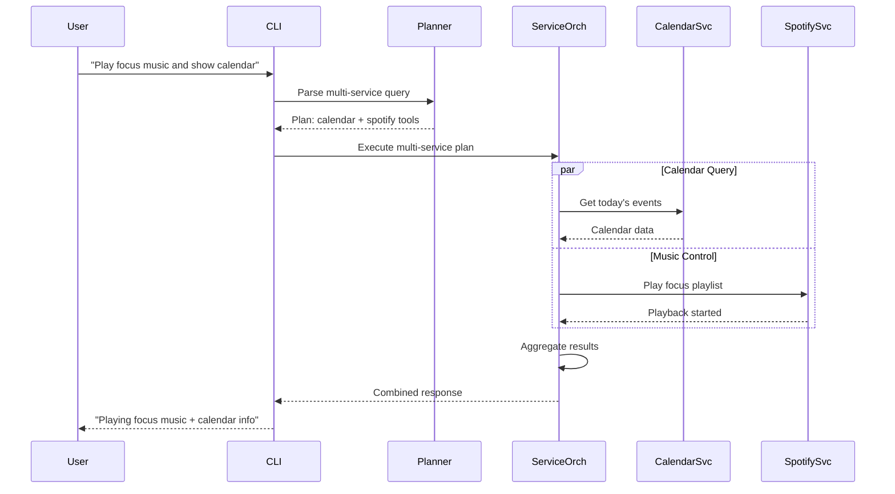

# Spotify Integration Example - Connection Hub in Action

## 🎵 Overview

This document demonstrates how the **Multi-Service Connection Hub** architecture would work in practice by showing how to add Spotify integration alongside Google Calendar. This showcases the extensible, pluggable nature of the connection hub approach.

## 🔌 Service Registration

### Spotify Service Provider Definition
```typescript
// src/services/spotify-service.ts
import { BaseService } from './base-service.js';
import { ServiceCapability, Tool } from '../types/index.js';

export class SpotifyService extends BaseService {
  constructor(connectionManager: ConnectionManager) {
    super('spotify', connectionManager);
  }

  getCapabilities(): ServiceCapability[] {
    return [
      'music.read',           // Read playlists, tracks, etc.
      'music.control',        // Play, pause, skip tracks
      'music.search',         // Search for music
      'music.library',        // Access user's library
      'music.queue'           // Manage playback queue
    ];
  }

  generateTools(): Tool[] {
    return [
      this.createPlaylistTool(),
      this.createMusicControlTool(),
      this.createMusicSearchTool(),
      this.createCurrentTrackTool(),
      this.createLibraryTool()
    ];
  }

  // Service-specific implementations
  async getPlaylists(userId: string): Promise<Playlist[]> {
    const tokens = await this.connectionManager.getValidTokens(userId, 'spotify');
    // Implementation using Spotify Web API
  }

  async playPlaylist(userId: string, playlistId: string): Promise<PlaybackState> {
    const tokens = await this.connectionManager.getValidTokens(userId, 'spotify');
    // Implementation using Spotify Web API
  }

  async getCurrentTrack(userId: string): Promise<Track | null> {
    const tokens = await this.connectionManager.getValidTokens(userId, 'spotify');
    // Implementation using Spotify Web API
  }

  async searchMusic(userId: string, query: string): Promise<SearchResult> {
    const tokens = await this.connectionManager.getValidTokens(userId, 'spotify');
    // Implementation using Spotify Web API
  }
}
```

### Service Provider Registration
```typescript
// src/connections/service-providers.ts
export const SPOTIFY_PROVIDER: ServiceProvider = {
  id: 'spotify',
  name: 'Spotify',
  authConfig: {
    clientId: process.env.SPOTIFY_CLIENT_ID!,
    clientSecret: process.env.SPOTIFY_CLIENT_SECRET!,
    redirectUri: `${process.env.BASE_URL}/auth/spotify/callback`,
    authUrl: 'https://accounts.spotify.com/authorize',
    tokenUrl: 'https://accounts.spotify.com/api/token',
    scopes: [
      'user-read-playback-state',
      'user-modify-playback-state', 
      'user-read-currently-playing',
      'playlist-read-private',
      'playlist-read-collaborative',
      'user-library-read'
    ]
  },
  apiConfig: {
    baseUrl: 'https://api.spotify.com/v1',
    rateLimits: {
      requestsPerSecond: 10,
      requestsPerMinute: 600
    }
  },
  capabilities: [
    'music.read',
    'music.control', 
    'music.search',
    'music.library',
    'music.queue'
  ]
};

// Register in service registry
serviceRegistry.registerService(SPOTIFY_PROVIDER);
```

## 🛠️ Dynamic Tool Generation

### Auto-Generated Spotify Tools
```typescript
// Auto-generated based on service capabilities
export const spotifyTools = {
  playMusic: tool({
    description: "Play music on Spotify - playlists, albums, or specific tracks",
    inputSchema: z.object({
      query: z.string().describe("What to play (playlist name, song, artist, etc.)"),
      context: z.enum(['playlist', 'track', 'album', 'artist']).optional(),
    }),
    execute: async ({ query, context }) => {
      const spotifyService = serviceRegistry.getService('spotify');
      return await spotifyService.playMusic(getCurrentUserId(), query, context);
    },
  }),

  getCurrentMusic: tool({
    description: "Get information about what's currently playing on Spotify",
    inputSchema: z.object({}),
    execute: async () => {
      const spotifyService = serviceRegistry.getService('spotify');
      return await spotifyService.getCurrentTrack(getCurrentUserId());
    },
  }),

  listPlaylists: tool({
    description: "List user's Spotify playlists",
    inputSchema: z.object({
      filter: z.string().optional().describe("Filter playlists by name"),
    }),
    execute: async ({ filter }) => {
      const spotifyService = serviceRegistry.getService('spotify');
      return await spotifyService.getPlaylists(getCurrentUserId(), filter);
    },
  }),

  controlPlayback: tool({
    description: "Control Spotify playback (play, pause, skip, previous, volume)",
    inputSchema: z.object({
      action: z.enum(['play', 'pause', 'next', 'previous', 'volume']),
      value: z.number().optional().describe("Volume level (0-100) when action is volume"),
    }),
    execute: async ({ action, value }) => {
      const spotifyService = serviceRegistry.getService('spotify');
      return await spotifyService.controlPlayback(getCurrentUserId(), action, value);
    },
  }),
};
```

## 🔄 Cross-Service Integration Examples

### Multi-Service User Queries
```typescript
// Example 1: Calendar + Music
"What's on my calendar today and play some focus music"

// Query Planning:
{
  reasoning: "User wants calendar info AND music control - requires Google Calendar and Spotify",
  tools: ["calendarQuery", "playMusic"],
  parameters: {
    calendarQuery: ["today's events"],
    playMusic: ["focus music playlist"]
  },
  expectedWorkflow: "Get today's calendar events, then start focus music for productivity"
}

// Example 2: Context-Aware Music
"I have a client meeting in 30 minutes, play appropriate background music"

// Query Planning:
{
  reasoning: "Check calendar for upcoming meeting context, then select appropriate music",
  tools: ["calendarQuery", "playMusic"],
  parameters: {
    calendarQuery: ["upcoming meetings next 30 minutes"],
    playMusic: ["calm background music"]
  },
  expectedWorkflow: "Check meeting details, then play professional background music"
}

// Example 3: Mood-Based Integration
"I'm done with meetings for the day, celebrate with some upbeat music"

// Query Planning:
{
  reasoning: "Check if meetings are done, then play celebratory music",
  tools: ["calendarQuery", "playMusic"],
  parameters: {
    calendarQuery: ["remaining meetings today"],
    playMusic: ["upbeat celebration music"]
  },
  expectedWorkflow: "Confirm no more meetings, then play energetic music"
}
```

## 🎯 Real-World Usage Examples

### User Experience Flow
```bash
🤖 Your query: Connect my Spotify account

🧠 Planning... ✅
🔧 Opening authentication... 🎵 ✅
🎭 Processing connection... ✅

🎉 RESPONSE:
✅ Spotify connected successfully!
🎵 Found 47 playlists in your library
🔗 Available capabilities: music control, playlist access, search
🛠️ New tools unlocked: playMusic, getCurrentMusic, listPlaylists, controlPlayback

You can now use commands like:
• "Play my Focus playlist"
• "What's currently playing?"
• "Skip to next song"
• "Show me my workout playlists"

---

🤖 Your query: Play my Focus playlist and show me what's on my calendar today

🧠 Planning... ✅
🔧 Executing tools... 📅🎵 ✅
🎭 Synthesising... ✅

🎉 RESPONSE:
🎵 **Now Playing**: Focus Flow playlist (47 songs, 3h 12m)
   Currently: "Weightless" by Marconi Union

📅 **Today's Calendar**:
   • 10:00 AM - Team standup (30 mins) - Starting in 45 minutes
   • 2:00 PM - Client presentation (1 hour)
   • 4:30 PM - Code review session (45 mins)

Perfect focus music for your productive day ahead! 🎧✨

---

🤖 Your query: What's playing and when is my next meeting?

🧠 Planning... ✅
🔧 Executing tools... 🎵📅 ✅
🎭 Synthesising... ✅

🎉 RESPONSE:
🎵 **Currently Playing**: "Deep Focus" by Various Artists
   📱 From: "Study Beats" playlist
   ⏱️ 2:34 / 4:12 remaining

📅 **Next Meeting**: Team standup in 12 minutes (10:00 AM)
   👥 With: Sarah, Mike, Alex
   📍 Conference Room B / Zoom link available

You have time to finish this track before your meeting! 🎶
```

## 🔧 Technical Implementation

### Service Connection Flow


### Multi-Service Query Flow


## 📊 Database Updates for Spotify

### Service Provider Entry
```sql
INSERT INTO service_providers (id, name, auth_config, api_config, capabilities, is_active) 
VALUES (
  'spotify',
  'Spotify',
  '{
    "clientId": "SPOTIFY_CLIENT_ID",
    "authUrl": "https://accounts.spotify.com/authorize",
    "tokenUrl": "https://accounts.spotify.com/api/token",
    "scopes": ["user-read-playback-state", "user-modify-playback-state", "playlist-read-private"]
  }',
  '{
    "baseUrl": "https://api.spotify.com/v1",
    "rateLimits": {"requestsPerSecond": 10, "requestsPerMinute": 600}
  }',
  '["music.read", "music.control", "music.search", "music.library"]',
  true
);
```

### Dynamic Tool Registration
```sql
INSERT INTO available_tools (service_id, tool_name, tool_description, tool_schema, required_capabilities)
VALUES 
('spotify', 'playMusic', 'Play music on Spotify', '{"type":"object","properties":{"query":{"type":"string"}}}', '["music.control"]'),
('spotify', 'getCurrentMusic', 'Get current playing track', '{"type":"object","properties":{}}', '["music.read"]'),
('spotify', 'listPlaylists', 'List user playlists', '{"type":"object","properties":{"filter":{"type":"string"}}}', '["music.read"]'),
('spotify', 'controlPlayback', 'Control music playback', '{"type":"object","properties":{"action":{"type":"string"}}}', '["music.control"]');
```

## 🚀 Benefits of Connection Hub Approach

### 1. **Easy Service Addition**
- Adding Slack: Create `SlackService`, register provider, tools auto-generated
- Adding GitHub: Create `GitHubService`, register provider, tools auto-generated
- Adding Notion: Create `NotionService`, register provider, tools auto-generated

### 2. **Consistent User Experience** 
- Same connection flow for all services
- Unified tool discovery and usage
- Consistent error handling and recovery

### 3. **Cross-Service Intelligence**
- "Schedule a meeting and set status to busy in Slack"
- "Create a GitHub issue for this calendar event"
- "Play music based on my calendar mood"

### 4. **Scalable Architecture**
- Each service is isolated and testable
- Services can be enabled/disabled per user
- Easy to maintain and extend

### 5. **Future-Proof Design**
- New OAuth providers easily supported
- Service-specific customizations possible
- Backward compatibility maintained

This example demonstrates how the connection hub transforms Vibeplexity from a single-purpose tool into a comprehensive personal assistant that can orchestrate multiple services seamlessly!
